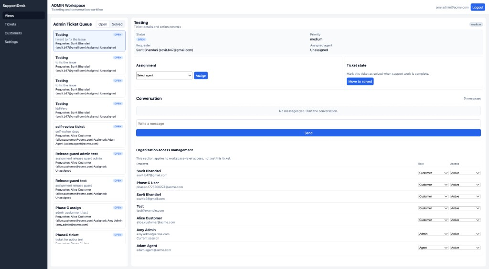

# SupportDesk

SupportDesk is a lightweight, multi-tenant customer support platform with:
- authentication + RBAC
- ticket creation and assignment
- customer/agent messaging
- live updates (SSE)
- background notifications

## Screenshot



## Project structure

```text
SupportDesk/
├── apps/
│   ├── backend/        # Express API, auth, RBAC, tickets, SSE, worker
│   └── frontend/       # React + Vite UI (admin/agent/customer workspaces)
├── packages/
│   └── db/             # SQL migrations, seed data, db scripts
├── docs/
│   ├── database-schema.md
│   └── images/
│       └── admin-workspace.png
├── docker-compose.yml  # Postgres + Redis + Mailhog
└── package.json        # Monorepo scripts
```

## Prerequisites (install once)

- [Docker Desktop](https://www.docker.com/products/docker-desktop/) (or Docker + Compose)
- Node.js 20+
- npm 10+

## Run locally (beginner-friendly)

From the repository root:

1. Install dependencies
   ```bash
   npm install
   ```

2. Start local services (database, redis, mail testing)
   ```bash
   npm run db:up
   ```

3. Apply database migrations
   ```bash
   npm run db:migrate
   ```

4. Seed sample users and data
   ```bash
   npm run db:seed
   ```

5. Start the app (API + frontend together)
   ```bash
   npm run dev
   ```

6. Open the app
   - Frontend UI: `http://localhost:5173`
   - API health check: `http://localhost:4000/health`

## Demo accounts

- Admin: `amy.admin@acme.com`
- Agent: `adam.agent@acme.com`
- Customer: `alice.customer@acme.com`
- Password (all seeded users): `hashed-password`

## Useful commands

```bash
npm run api:typecheck
npm run web:typecheck
npm run db:verify-isolation
npm run db:down
```

## Troubleshooting

- **“This site can’t be reached” on port 5173**
  - make sure `npm run dev` is running
- **Login fails with seeded users**
  - run `npm run db:migrate` and `npm run db:seed` again
- **API errors about DB**
  - confirm Docker is running and `npm run db:up` completed successfully
