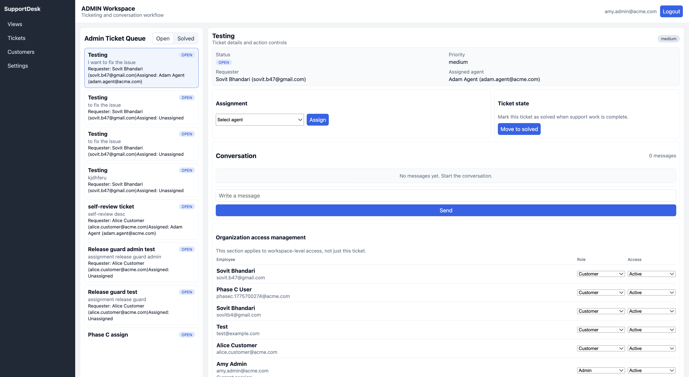

# SupportDesk

SupportDesk is a lightweight, multi-tenant customer support platform with:
- authentication + RBAC
- ticket creation and assignment
- customer/agent messaging
- live updates (SSE)
- background notifications

## Screenshot



## Project structure

```text
SupportDesk/
├── apps
│   ├── backend
│   │   ├── package.json
│   │   ├── README.md
│   │   ├── .env.example
│   │   └── src
│   │       ├── app.ts
│   │       ├── server.ts
│   │       ├── worker.ts
│   │       ├── config.ts
│   │       ├── middleware
│   │       │   ├── auth.ts
│   │       │   └── rbac.ts
│   │       ├── lib
│   │       │   ├── db.ts
│   │       │   ├── redis.ts
│   │       │   ├── events.ts
│   │       │   ├── queues.ts
│   │       │   ├── types.ts
│   │       │   └── validation.ts
│   │       ├── routes
│   │       │   ├── authRoutes.ts
│   │       │   ├── organizationRoutes.ts
│   │       │   ├── userRoutes.ts
│   │       │   ├── ticketRoutes.ts
│   │       │   ├── streamRoutes.ts
│   │       │   ├── profileRoutes.ts
│   │       │   └── adminRoutes.ts
│   │       └── scripts
│   │           └── sprint3Smoke.ts
│   └── frontend
│       ├── package.json
│       ├── README.md
│       ├── index.html
│       ├── vite.config.ts
│       ├── tsconfig.json
│       └── src
│           ├── main.tsx
│           ├── App.tsx
│           ├── styles.css
│           ├── lib
│           │   └── theme.ts
│           ├── api
│           │   ├── client.ts
│           │   └── endpoints.ts
│           ├── hooks
│           │   ├── useAuth.tsx
│           │   └── useSseMessages.ts
│           ├── components
│           │   ├── Layout.tsx
│           │   ├── ProtectedRoute.tsx
│           │   └── ChatPanel.tsx
│           ├── pages
│           │   ├── LoginPage.tsx
│           │   ├── UnauthorizedPage.tsx
│           │   ├── ProfilePage.tsx
│           │   ├── DashboardRouter.tsx
│           │   ├── AdminDashboard.tsx
│           │   ├── AgentDashboard.tsx
│           │   ├── UserDashboard.tsx
│           │   ├── ViewsPage.tsx
│           │   ├── TicketsPage.tsx
│           │   └── CustomersPage.tsx
│           └── types
│               └── index.ts
├── packages
│   └── db
│       ├── package.json
│       ├── src
│       │   ├── client.ts
│       │   ├── config.ts
│       │   ├── schema.ts
│       │   └── scripts
│       │       ├── migrate.ts
│       │       ├── seed.ts
│       │       ├── rollback.ts
│       │       └── verifyIsolation.ts
│       └── migrations
│           ├── 001_init_schema.sql
│           ├── 002_enable_rls.sql
│           ├── 003_seed.sql
│           ├── 004_fix_rls_recursion.sql
│           ├── 005_add_manual_support_tables.sql
│           ├── 006_hash_legacy_passwords.sql
│           ├── 007_add_user_settings_fields.sql
│           ├── 008_enforce_light_dark_theme.sql
│           └── 999_rollback_sprint1.sql
├── docs
│   ├── database-schema.md
│   └── images
│       └── admin-workspace.png
├── docker-compose.yml
├── .env.example
├── package.json
└── README.md
```

## Prerequisites (install once)

- [Docker Desktop](https://www.docker.com/products/docker-desktop/) (or Docker + Compose)
- Node.js 20+
- npm 10+

## Run locally (beginner-friendly)

From the repository root:

1. Install dependencies
   ```bash
   npm install
   ```

2. Start the app (API + frontend together)
   ```bash
   npm run dev
   ```
   This command resets local containers/volumes, runs migrations, seeds demo data, and then starts backend + frontend.

3. Open the app
- Frontend UI: `http://localhost:5173`
- API health check: `http://localhost:4000/health`
- PostgreSQL container: `localhost:55432` mapped to container port `5432`

## Demo accounts

- Admin: `amy.admin@acme.com`
- Agent: `adam.agent@acme.com`
- Customer: `alice.customer@acme.com`
- Password (all seeded users, type exactly): `hashed-password`

## Useful commands

```bash
npm run check
npm run api:typecheck
npm run db:typecheck
npm run web:typecheck
npm run web:build
npm run db:verify-isolation
npm run db:down
```

## Operational endpoints

- Liveness: `GET /health`
- Readiness: `GET /readyz` checks owner DB, app DB, and Redis.
- Metrics snapshot: `GET /metrics` returns request counts, latency buckets, process memory, queue counts, and outbox backlog age.

Logs are structured JSON. `X-Request-Id` is accepted from callers or generated per request, returned on responses, and included in request/error logs. Logs intentionally avoid ticket subject/body/email values.

## Architecture and evidence

The main engineering contracts are documented in `docs/architecture.md`: tenant isolation, transactional outbox notification dispatch, and durable ticket-event replay over SSE.

For a local reviewer with Docker running, this command runs the static checks, starts PostgreSQL/Redis/MailHog, applies migrations, seeds synthetic/demo data, runs DB verification scripts, executes ReplayLab scenarios, and writes artifacts under `docs/evidence/local-demo/<run-id>/`:

```bash
npm run evidence:local
```

If Docker or another dependency is unavailable, the command records the failed step and exits nonzero instead of reporting a fabricated pass.

## CI

`.github/workflows/ci.yml` runs `npm ci`, `npm run check`, migrations, seed, and DB verification scripts against PostgreSQL and Redis services. The workflow has no `|| true` fallback; command failures fail the job.

## Troubleshooting

- **“This site can’t be reached” on port 5173**
  - make sure `npm run dev` is running
- **Login fails with seeded users**
  - run `npm run db:migrate` and `npm run db:seed` again
- **API errors about DB**
  - confirm Docker is running and `npm run db:up` completed successfully
