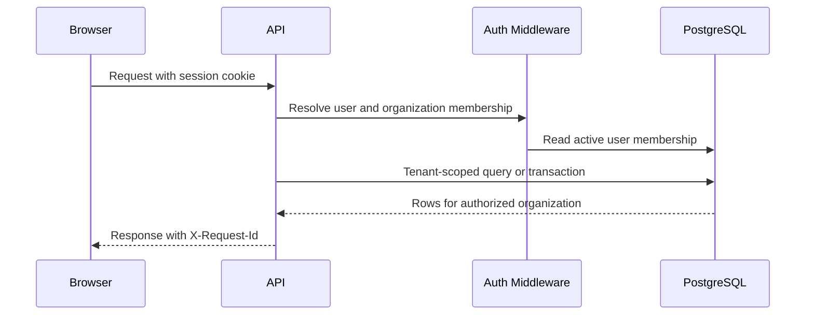
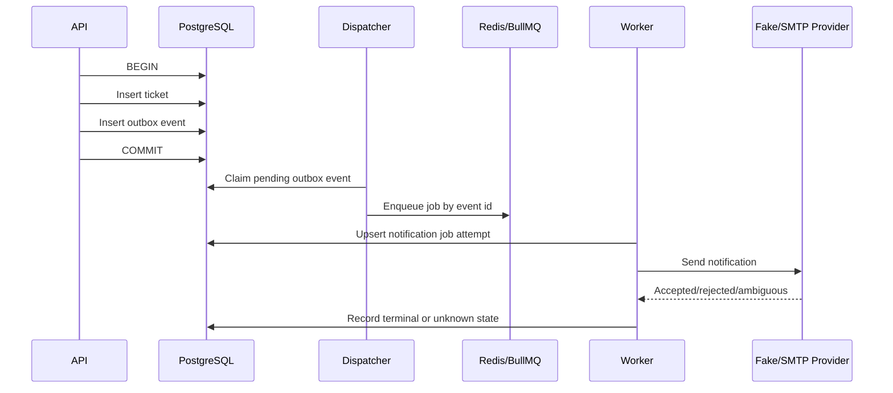
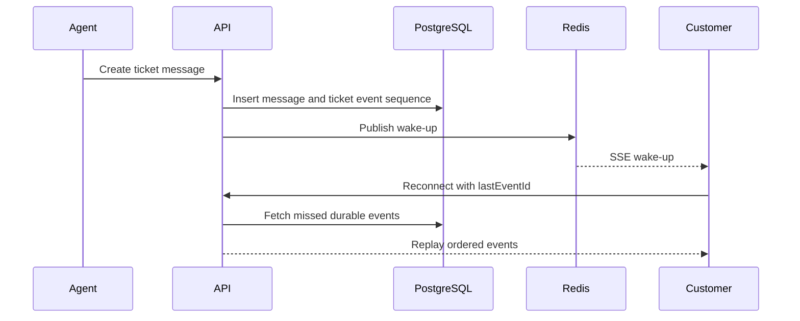

# SupportDesk Architecture Notes

This document explains the parts of SupportDesk that are useful to review for backend/full-stack engineering signal. It is intentionally scoped to the current repository and local evidence harnesses.

## Tenant Isolation

SupportDesk keeps each request tied to an authenticated user and organization membership. Runtime request SQL uses the app database role and tenant transaction helper where mutations need tenant context. Admin/auth membership reads join through both user and organization membership so role checks are scoped to the selected organization.



Key contracts:
- Users must be active members of the organization they access.
- Mutations that depend on tenant context should run through the app-role transaction helper.
- Failed or unauthorized cross-tenant access should return a controlled error, not leaked data.

## Transactional Outbox

Ticket creation writes the ticket, audit event, and notification intent in one PostgreSQL transaction. The dispatcher later claims pending outbox events and enqueues BullMQ jobs. The worker records notification job state and provider attempts. This improves durability without claiming exactly-once external delivery.



Key contracts:
- A rolled-back ticket creation must not leave an outbox event.
- A committed outbox event should reach an explicit disposition within a scenario timeout.
- If the provider accepts a message but local receipt persistence fails, the effect is unknown, not silently successful.

## Ticket Event Replay

Messages are recorded as durable per-ticket events with a monotonically increasing sequence. Redis/SSE is treated as a wake-up path. On reconnect, clients can request missed events after the last seen id, so loss of a transient wake-up does not need to mean loss of canonical message history.



Key contracts:
- Pagination must be bounded.
- A reconnect should replay events after the client cursor.
- The general live channel is transient; durable replay claims apply to ticket-specific event streams.

## Evidence Commands

For a reviewer with Docker running:

```bash
npm run evidence:local
```

The command stores logs and metadata in `docs/evidence/local-demo/<run-id>/`. It runs static checks, starts local dependencies, migrates and seeds the database, runs DB verification scripts, runs ReplayLab scenarios, and creates a benchmark plan artifact. If any dependency is unavailable, it stops and records the failed command instead of fabricating a pass.
